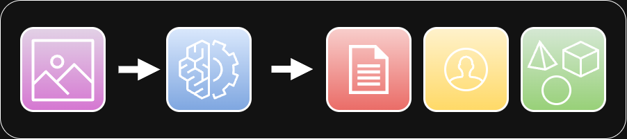
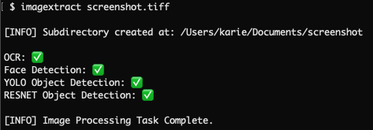

## imagextract

A command-line application to extract text, objects, and faces from image files (JPG, PNG, TIFF, PNG) using Apple Vision and CoreML APIs.




## Installation 

Imagextract requires Mac OS version 13 or greater to access the latest VisionKit APIs.

The easiest way to install textra is to open a terminal window and run the following command:

```bash
curl -L https://github.com/kariemoorman/imagextract/raw/main/install.sh | bash
```

Alternatively, download the latest release, unzip it, and place the `imagextract` executable somewhere on your `$PATH`.


## Usage

```bash
imagextract IMAGE_FILE
```

### Example




Results: [imagextract: Proof of Concept](example/README.md)


## License 

MIT


## Contributions

Contributions are welcome. Please submit an issue or feel free to fork and contribute a pull request.


## Acknowledgements

Inspired by projects such as [Textra](https://github.com/freedmand/textra) by [Dylan Freedman](https://github.com/freedmand) and [ObjectDetection-CoreML](https://github.com/tucan9389/ObjectDetection-CoreML) by [tucan9389](https://github.com/tucan9389).
