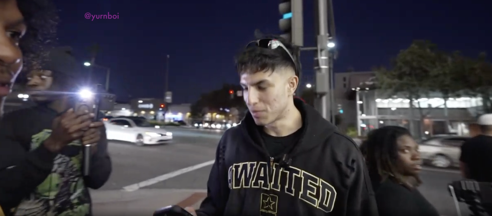
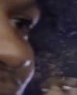
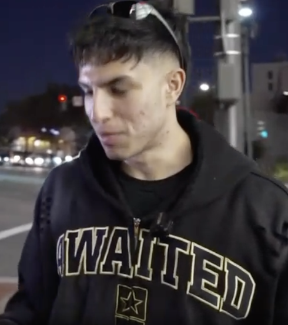
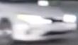
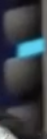
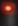

## imagextract: Proof of Concept

## Table of Contents

- [Input Image File](#input)
- [Results](#results)
  - [OCR](#ocr)
  - [Face Detection](#face-detection)
  - [Object Detection](#object-detection)

---

## Input



## Results 

### OCR 

(see [OCR_RecognizedText.txt](OCR_RecognizedText.txt))

```
@yurnboi
WAiTED
```

---

### Face Detection 

<p>3 Faces are detected:</p>

<p float="left">
  
  
  
</p>

---

### Object Detection 

<p>6 Objects are detected: 1 Person, 1 Car, 4 Traffic Lights</p>

<p float="left">
  
  
  
  
  
  
</p>

(see [YOLO_ObjectClassificationResults.json](YOLO_ObjectClassificationResults.json))

```
[
  {
    "boundingBox" : [
      0.40123444128160679,
      0.0035155713558197021,
      0.31821595287571347,
      0.81796878576278687
    ],
    "className" : "person",
    "confidence" : 97.673301696777344,
    "imageFileName" : "Object0.png",
    "objectNumber" : 0
  },
  {
    "boundingBox" : [
      0.27994791666666669,
      0.32404785230755806,
      0.071044160247159496,
      0.094091795384883881
    ],
    "className" : "car",
    "confidence" : 95.639739990234375,
    "imageFileName" : "Object1.png",
    "objectNumber" : 1
  },
  {
    "boundingBox" : [
      0.56489817301432299,
      0.79306640475988388,
      0.030085245768229164,
      0.20488281548023224
    ],
    "className" : "traffic light",
    "confidence" : 96.571426391601562,
    "imageFileName" : "Object2.png",
    "objectNumber" : 2
  },
  {
    "boundingBox" : [
      0.46493994649063097,
      0.54797362722456455,
      0.011324946249563556,
      0.03764648362994194
    ],
    "className" : "traffic light",
    "confidence" : 98.887809753417969,
    "imageFileName" : "Object3.png",
    "objectNumber" : 3
  },
  {
    "boundingBox" : [
      0.32500594399607508,
      0.49550780653953552,
      0.010110791360299723,
      0.025390625
    ],
    "className" : "traffic light",
    "confidence" : 98.956558227539062,
    "imageFileName" : "Object4.png",
    "objectNumber" : 4
  },
  {
    "boundingBox" : [
      0.68553464642657969,
      0.46892091073095798,
      0.012646548445142495,
      0.04497070237994194
    ],
    "className" : "traffic light",
    "confidence" : 98.212554931640625,
    "imageFileName" : "Object5.png",
    "objectNumber" : 5
  }
]
```


